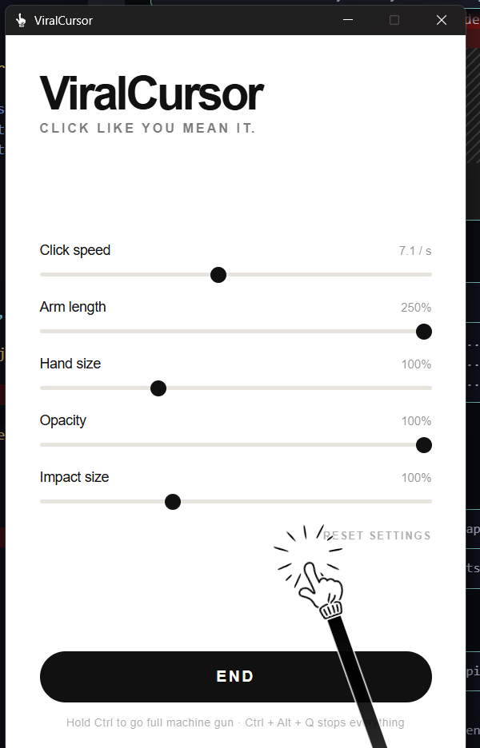

# ViralCursor

Your Windows cursor becomes the giant poking hand from the
[pokey](reference/pokey_cursor_fast_hold_fx_shake.html) demo. Click and it pokes.
Hold Ctrl and it turns into a machine gun.



The hand is drawn over everything, on every monitor, and keeps a white outline so it
stays readable on a dark desktop.

## What it does

- Replaces the system cursor everywhere with the animated hand — same SVG, same
  keyframes, same escalating poke as the web demo.
- Click bursts escalate: `poke-gentle` → `poke-medium` → `poke-strong` → `poke-jab`,
  each with its own impact flash.
- **Hold Ctrl** for 150 ms and it turns into a machine gun: ~11 pokes per second with
  rapid impact flashes.
- The art carries a white outline drawn under the fill, so the black-on-white hand and
  flashes stay readable on a black desktop too.
- Spans every monitor.

The mouse deliberately does nothing but poke, so dragging and dropping keep working.
Ctrl is the trigger for the loud part.

## Controls

| Setting | Range | Default |
|---|---|---|
| Click speed | 3.8 – 25 pokes/s | 10.9 /s |
| Arm length | 30 – 250 % | 100 % |
| Hand size | 50 – 220 % | 100 % |
| Opacity | 15 – 100 % | 100 % |
| Impact size | 50 – 200 % | 100 % |

**Ctrl + Alt + Q** stops everything and gives the normal cursor back. It works even if
the window is buried, which matters: hiding the cursor is a system-wide change.

## Build

Needs [Rust](https://rustup.rs) and [Bun](https://bun.sh).

```bash
bun install
bun run build     # -> src-tauri/target/release/ViralCursor.exe
bun run dev       # run without packaging
```

Regenerating the icon from the demo's SVG:

```bash
bun tools/build-icon.mjs && bunx tauri icon icon.png
```

## How it works

| Piece | Where |
|---|---|
| Hand + flash SVG, keyframes | `src/overlay.css`, `src/overlay.html` |
| Poke escalation, machine gun | `src/overlay.js` |
| Control panel | `src/index.html`, `src/panel.js` |
| Hiding the real cursor | `src-tauri/src/cursor.rs` (`SetSystemCursor`) |
| Mouse + Ctrl feed, panic hotkey | `src-tauri/src/hook.rs` (`WH_MOUSE_LL`, `WH_KEYBOARD_LL`) |
| Full-screen fallback | `src-tauri/src/fullscreen.rs` |
| Overlay window, wiring | `src-tauri/src/lib.rs` |

`src/overlay.html` is generated — do not edit it by hand. It is assembled from
`reference/pokey_cursor_fast_hold_fx_shake.html` so the SVG art cannot drift from the
original:

```bash
python tools/build-overlay.py
```

The overlay is a transparent, click-through, always-on-top window spanning every
monitor. Because it is click-through it never receives mouse events itself, so the
pointer position comes from a global low-level mouse hook in Rust.

## Known limits

- Windows only. The whole effect is built on Win32 APIs.
- The hand keeps working in ordinary full screen — a browser at F11 is not a topmost
  window, so the always-on-top overlay still paints over it. Only a window that is
  *also* topmost can win, and there the app hands the plain cursor back rather than
  leave you with no pointer at all: the snipping overlay PrintScreen opens, or a game
  on exclusive full screen.
- UAC prompts run on their own secure desktop, which neither the overlay nor the
  cursor replacement reaches: there you briefly get the plain system arrow back.
- There is no desktop shake. It was built on `MagSetFullscreenTransform`, which the
  compositor applies after the frame screen recorders capture — the shake was
  invisible in any recording, which defeats the point.
